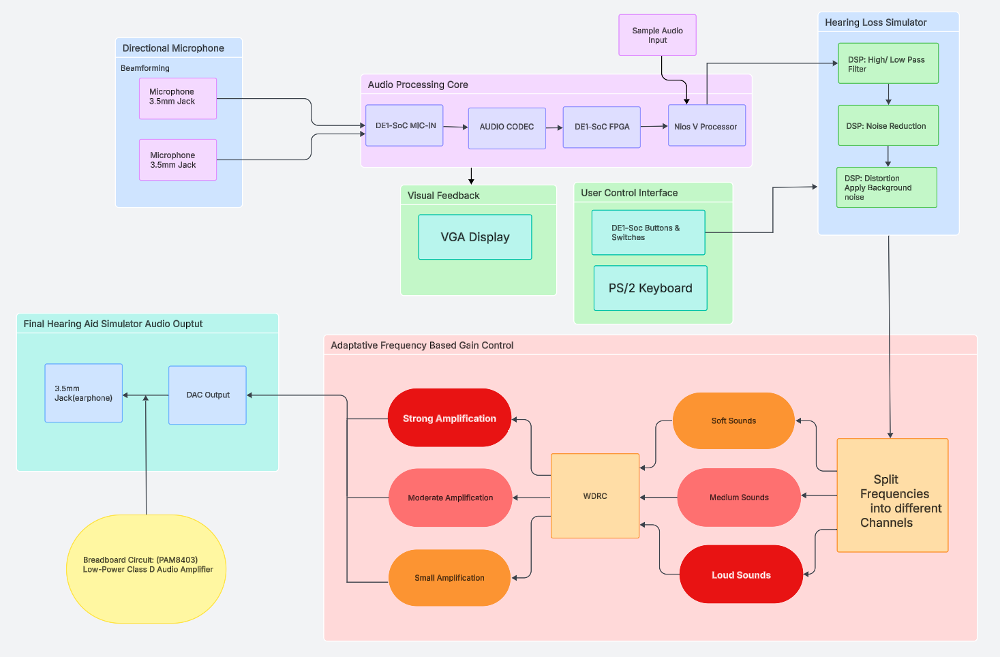
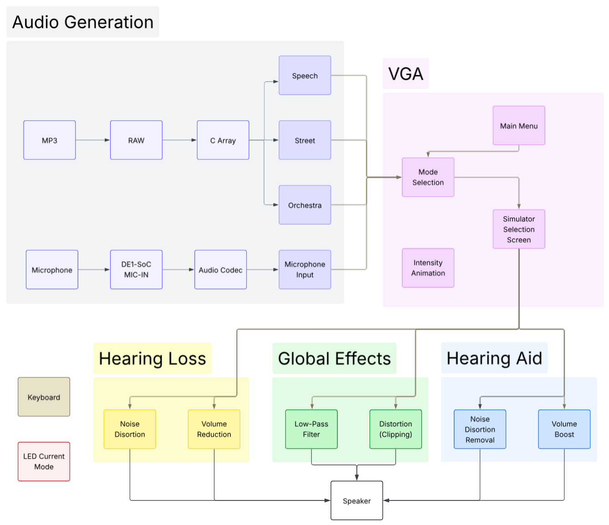
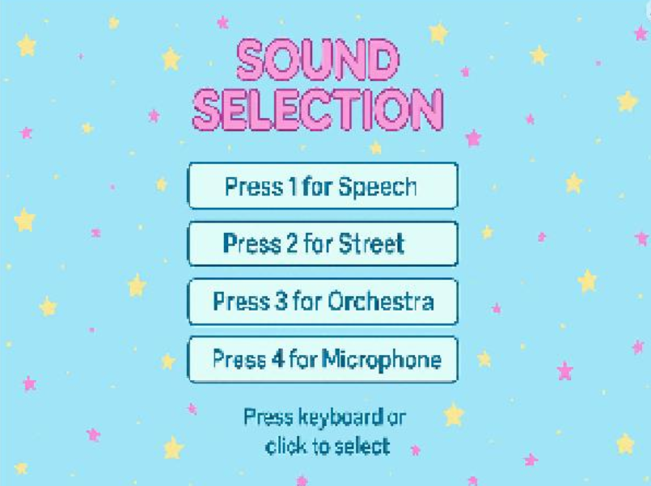
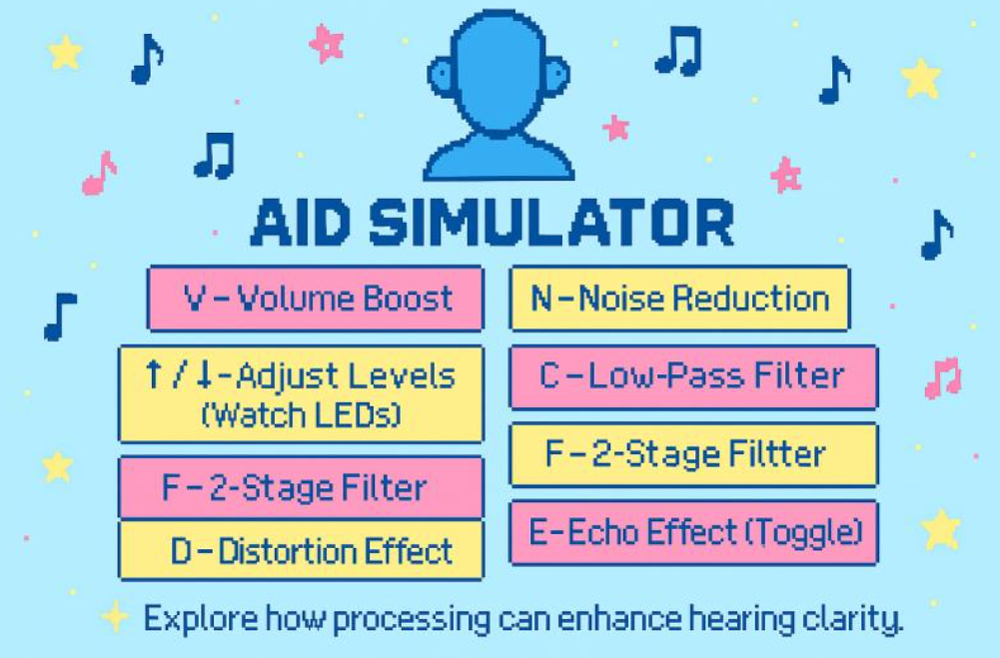
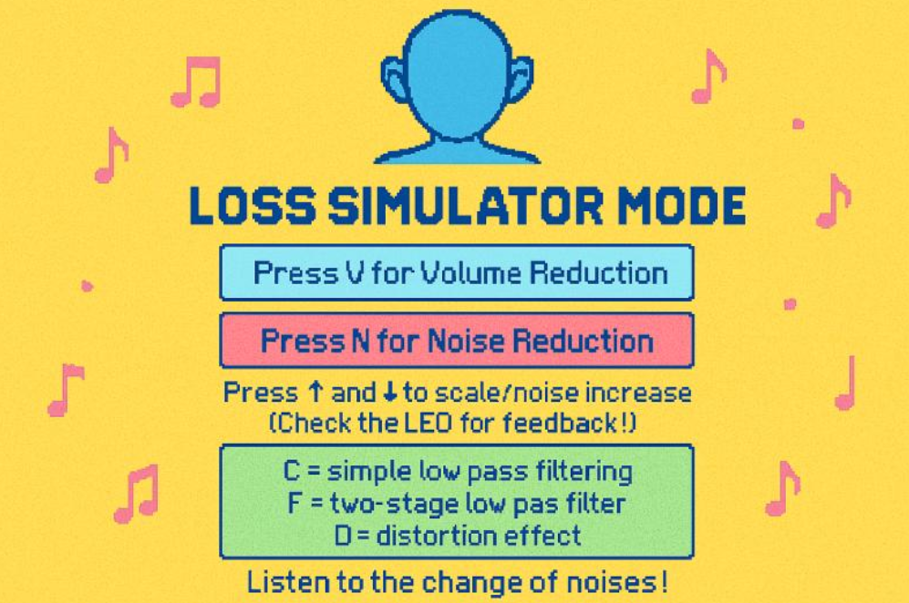
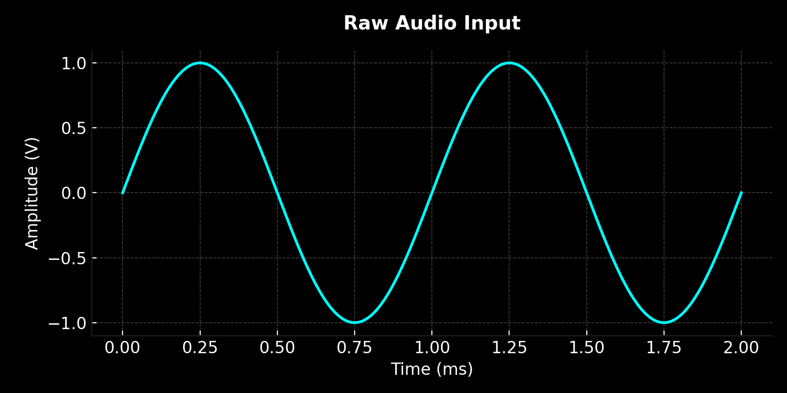
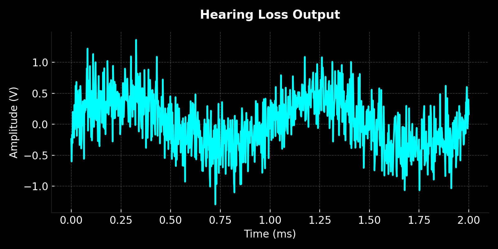
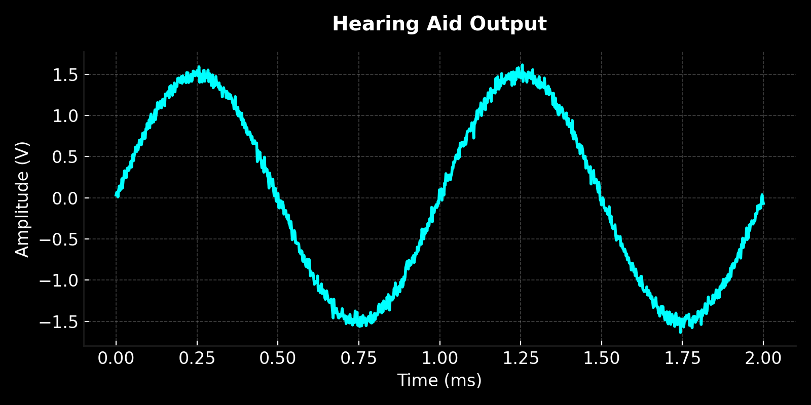

[](LICENSE)

# FPGA-NiosV Hearing Loss & Aid Simulator
_Real-time DSP in **Embedded C** on a **Nios® V** soft processor inside the **DE1-SoC** FPGA.


---
## 📑 Table of Contents
1. [Tech Stack](#-tech-stack)
2. [System Architecture](#system-architecture)
3. [DSP Technical Implementation](#dsp-technical-implementation-embedded-c-on-nios-v)
4. [User Interface Screens](#-user-interface-screens)
5. [Waveform Verification](#waveform-verification)
6. [Screens & Modes](#screens--modes)
7. [Controls](#controls-ps2-keyboard--keys)
8. [Performance Metrics](#performance-metrics)
9. [Try It Yourself (Emulator)](#try-it-yourself-emulator)
10. [Repository Structure](#-repository-structure)
11. [About the Author](#about-the-author)

---

## Tech Stack
| Domain | Technologies |
|---|---|
| **Hardware Platform** | Terasic **DE1-SoC** FPGA |
| **Soft Processor** | **Intel Nios® V** |
| **Languages** | **Embedded C** (DSP core & UI) |
| **Audio DSP** | Gain (attenuation/amplification), noise injection/suppression, echo (delay+feedback), optional filtering & distortion |
| **Interfaces** | **PS/2** keyboard, **VGA** display, **LEDs**, mic input |
| **Tooling** | Intel **Quartus Prime**, **Platform Designer**, ModelSim (signal inspection), **Tcl** (automation), **Matplotlib** (waveform visuals) |

---

## System Architecture

| Original Concept | Final Implementation |
|---|---|
|  |  |

---

## DSP Technical Implementation (Embedded C on Nios V)

**All processing runs in real time on the Nios V soft core.** Core effects:

### 1) Echo (Delay + Feedback)
- **What:** Reverberation in aid mode for mic input  
- **How:** Circular delay buffers per channel; feedback mixing with adjustable damping  
- **Form:** `y[n] = x[n] + α · d[n]`, with `α ∈ {0.5, 0.75, 1.0, 1.5}` (keyboard-controlled)

### 2) Gain Scaling
- **Loss mode (attenuation):** `sample /= {2, 3, 5, 10}` to mimic reduced audibility  
- **Aid mode (amplification):** `sample *= {10, 20, 30, 40}` to boost clarity (clipping guarded by limiter)

### 3) Noise Injection / Subtraction
- **Loss mode:** adds pseudo-random noise at adjustable levels to degrade intelligibility  
- **Aid mode:** subtracts/attenuates noise component after gain to improve SNR

> Optional stages (toggleable): simple low-pass smoothing and soft clipping/limiting for overload control.

---

## User Interface Screens

| Start Screen | Sound Mode Selection | Aid Simulator |
|---|---|---|
|  <br> **Main menu** with navigation hints. |  <br> **Choose** Loss / Aid or mic/sample source. |  <br> **Aid mode** with gain, noise control, and echo. |

| Loss Simulator | Microphone Selected |
|---|---|
|  <br> **Loss mode**: attenuation + noise/distortion options. |  <br> **Live input** for real-time processing. |

---

## Waveform Verification
*Plots generated in **Matplotlib** to reflect oscilloscope observations.*

| Raw Audio | Hearing Loss Mode | Hearing Aid Mode |
|---|---|---|
|  |  |  |


Validation was performed using a DE1-SoC development board with oscilloscope signal inspection; Matplotlib plots were generated to match observed waveforms for documentation purposes.

---

## Screens & Modes

| Screen / Mode | Description |
|---|---|
| `Homepage` | Intro screen; choose between samples or mic mode |
| `Mode Select` | Pick sample 1 (conversation), 2 (busy street), 3 (orchestra), or mic input |
| `Simulator` | Playback screen before choosing Aid/Loss |
| `Hearing Loss` | Muffled, distorted, or noisy hearing simulation |
| `Hearing Aid` | Gain, echo, filtering, and distortion reduction |
| `Mic Mode` | Real-time mic input with processing & echo |

---

## Controls (PS/2 Keyboard + Keys)

| Key | Action |
|---|---|
| `1` / `2` / `3` | Select sample (conversation / street / orchestra) |
| `4` | Switch to microphone input mode |
| `←` | Switch to Hearing Loss |
| `A` | Switch to Hearing Aid |
| `V` / `N` / `S` | Adjust volume / noise / speech distortion |
| `E` | Toggle echo |
| `H` | Return to homepage |
| `↑` / `↓` | Increase / decrease selected effect level |

---

## Performance Metrics

- **8 ms latency** — Mic-in to processed stereo-out  
- **100 MHz clock** — < 1 ns post-fit slack  
- **12% LUT / 5% BRAM** — Nios V + DSP core  
- **Instant mode switching** — No audio dropouts  

---

## Try It Yourself (Emulator)
Run in-browser: **cpulator – DE1-SoC NiosV**  
🔗 https://cpulator.01xz.net/?sys=rv32-de1soc

**Steps**
1) Set language to **C**  
2) Upload `REAL_FINAL_CODE.c`  
3) Open **PS/2 Keyboard 1**  
4) Use the controls above

---

## 📂 Repository Structure
```
images/ # Diagrams, UI screenshots, waveform visuals
src/ # Embedded C source for Nios V (DSP + UI)
docs/ # Notes / design artifacts
README.md
LICENSE
```
---

## About the Author
- **[Hyeonji Jung](https://www.linkedin.com/in/hyeonjijung/)** — Designed DSP audio processing logic, created UI screens, and implemented LED toggle control logic  